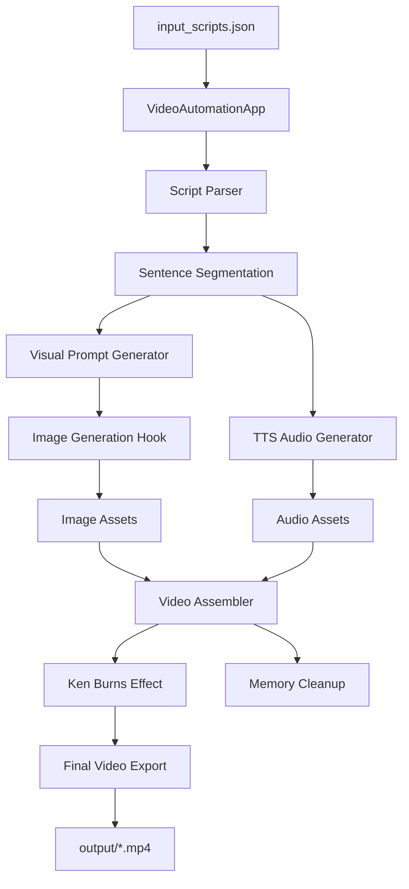

# Video Automation Application - Business Logic

## Overview
This application automates video creation from JSON scripts by generating images from text prompts, synthesizing human-like speech, and assembling videos with cinematic effects.

## Architecture



## Data Flow

### 1. Input Processing
- **Direct Source**: `input_scripts.json`
- **Remote Source**: Telegram Bot Messages (via OpenClaw)
- **Structure**: Array of project objects or raw text messages
  - `project_name`: String identifier
  - `script_text`: Full narrative text

### 2. Messaging Gateway (OpenClaw)
- **Platform**: Telegram
- **Bot**: [@Champahitonlybot](https://t.me/Champahitonlybot)
- **Role**: Serves as the interface for remote control and notification.
- **Data Flow**:
  1. User sends script to Telegram Bot.
  2. OpenClaw receives message and triggers the agent.
  3. Status updates are sent back to the user via Telegram.

### 2. Script Segmentation
- **Method**: Regex split on sentence boundaries (`.`, `!`, `?`)
- **Output**: Array of sentence strings
- **Purpose**: Create individual video segments for each sentence

### 3. Visual Prompt Generation
- **Input**: Single sentence string
- **Logic**: 
  - Clean text (remove special characters)
  - Append cinematic descriptors: "cinematic lighting, photorealistic, 4k, architectural detail, highly detailed"
- **Output**: Enhanced prompt string for image generation

### 4. Asset Generation (Parallel)

#### Image Generation
- **Hook**: `generate_image_asset(visual_prompt, output_filename)`
- **Integration**: Calls Antigravity's internal `generate_image` tool
- **Output**: PNG image file in `temp/{project_name}/img_{i}.png`

#### Audio Generation
- **Library**: `edge-tts` (async)
- **Voice**: `en-US-ChristopherNeural` (human-like neural voice)
- **Output**: MP3 audio file in `temp/{project_name}/audio_{i}.mp3`

### 5. Video Assembly

#### Clip Creation
For each segment:
1. Load audio to determine duration
2. Create `ImageClip` with matching duration
3. Apply Ken Burns effect (zoom 1.0 → 1.15)
4. Attach audio track
5. Set FPS to 24

#### Ken Burns Effect
```python
def apply_ken_burns(clip, duration, zoom_ratio=1.15):
    # Linear zoom interpolation over time
    def effect(t):
        return 1 + (zoom_ratio - 1) * (t / duration)
    return clip.resize(effect)
```

#### Concatenation
- **Method**: `concatenate_videoclips(clips, method="compose")`
- **Output**: Single continuous video

### 6. Export & Optimization

#### Codec Settings (M1 Optimized)
- **Video Codec**: `libx264`
- **Audio Codec**: `aac`
- **Preset**: `medium` (balance quality/speed)
- **Threads**: `4` (M1 efficiency cores)
- **FPS**: `24`

### 7. Memory Management

#### Per-Project Cleanup
1. Close all video clips
2. Delete `temp/{project_name}/` directory
3. Call `gc.collect()`

#### Final Cleanup
- Remove entire `temp/` directory
- Ensures 16GB RAM constraint is respected

## Error Handling
- Missing images trigger warnings and segments are skipped during assembly
- Project-level try-catch prevents cascade failures
- Temp cleanup runs even on errors

## Performance Characteristics

### Memory Profile
- **Peak Usage**: ~2-3GB per project (depends on image resolution)
- **Mitigation**: Sequential processing + aggressive cleanup

### Processing Time (Estimated)
- Image generation: ~5-10s per segment (depends on Antigravity)
- TTS generation: ~1-2s per segment
- Video encoding: ~30s per minute of final video

## File Structure
```
triple-perigee/
├── main.py                 # Core application
├── requirements.txt        # Python dependencies
├── input_scripts.json      # Input data
├── temp/                   # Temporary assets (auto-deleted)
│   └── {project_name}/
│       ├── img_0.png
│       ├── audio_0.mp3
│       └── ...
└── output/                 # Final videos
    ├── Video_01_History.mp4
    └── Video_02_Space.mp4
```

## Key Design Decisions

### Why edge-tts?
- Neural voices without local ML models
- Async API for better performance
- No API keys required

### Why moviepy?
- Python-native video editing
- Flexible effects API
- Good ARM64 compatibility

## Infrastructure (OpenClaw)
- **Primary Model**: `ollama/qwen3:8b` (configured for reasoning)
- **Context Window**: 40,960 tokens
- **Gateway**: `openclaw` running on port 18789
- **Channels**:
    - **Telegram**: Enabled (bot: @Champahitonlybot)
    - **WhatsApp**: Enabled

---
*Last updated: 2026-02-08*
